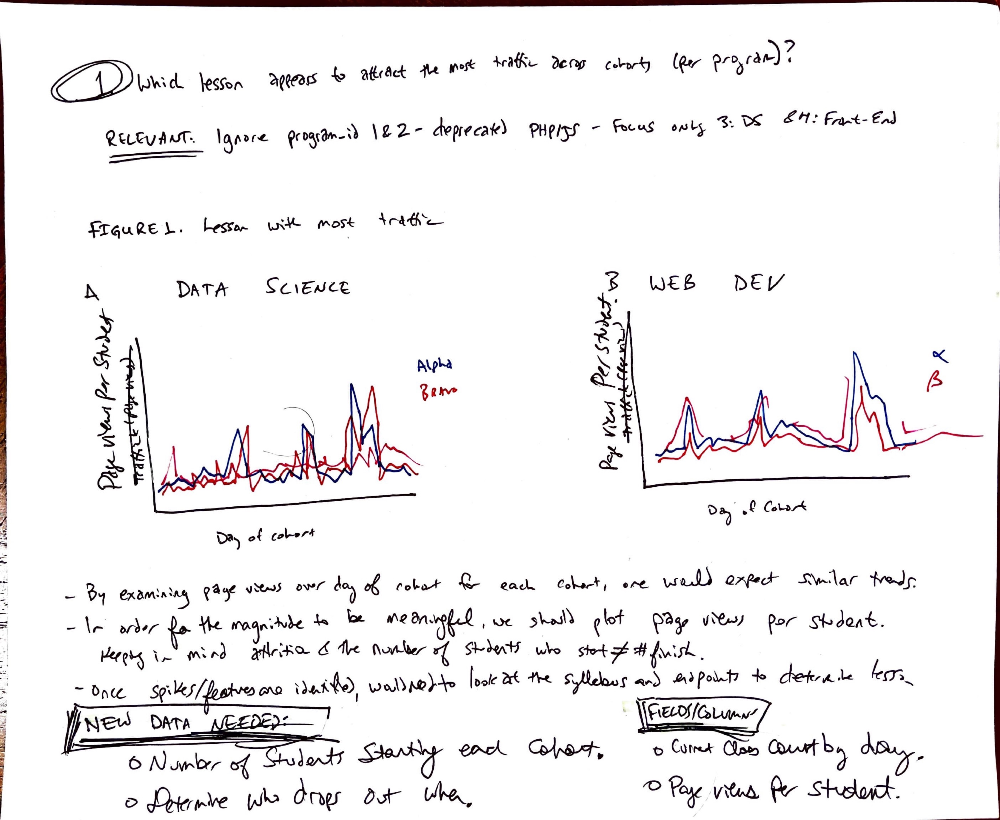
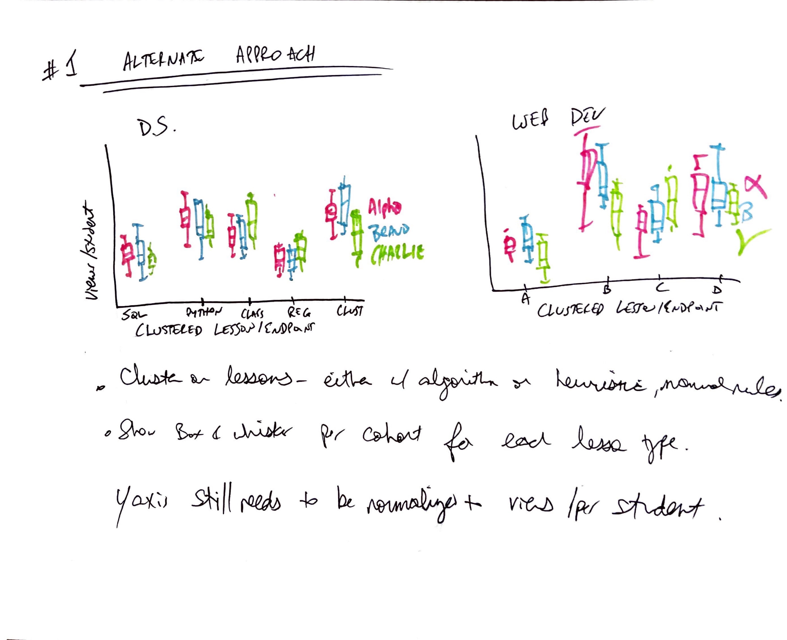

# Project Title

A brief description of what this project does and who it's for

## Authors

- [@jaredgodar](https://www.github.com/Jared-Godar)
- [@brianclements](https://www.github.com/Jared-Godar)

## About the Project

A stakeholder has provided a list of questions to be answered before a board meeting. There is some ambiguity in the questions. Make and explain appropriate assumptions to answer these questions focusing on content delivery to students and any issues that may impact the bottom line of the organization.

## Project Goals

Acquire and explore website access data in order to answer questions about content access and delivery. 

**DELIVERABLES:**
[] Email answering questions in clear language.
- Include link to notebook.
- Attach slide.
[] Single slide describing most interesting or impactful finding(s).
- Executive fummary format.
[] Github final notebook showing data exploration used to answer the questions.
[] Use modules (acquire.py, prepare.py, etc.)

## Project Description

## Initial Questions

1. Which lesson appears to attract the most traffic consistently across cohorts (per program)?

2. Is there a cohort that referred to a lesson significantly more than other cohorts seemed to gloss over?

3. Are there students who, when active, hardly access the curriculum? If so, what information do you have about these students?

4. Is there any suspicious activity, such as users/machines/etc accessing the curriculum who shouldn’t be? Does it appear that any web-scraping is happening? Are there any suspicious IP addresses?

5. At some point in 2019, the ability for students and alumni to access both curriculums (web dev to ds, ds to web dev) should have been shut off. Do you see any evidence of that happening? Did it happen before?

6. What topics are grads continuing to reference after graduation and into their jobs (for each program)?

7. Which lessons are least accessed?

8. Anything else notable in the data?

## Data Dictionary

## Steps to Reproduce

- [X] Read README.md.
- [] Clone repository to your local environment.
- [] Ensure your `.gitignore` file contains `env.py`. 
- [] Ensure you have an `env.py` file with appropriate SQL database access credentials in your local folder.
- [] 

- ## Plan

1. **Setup**
   1. Create a new organization with a repository with both teammates as owners.
   2. Clone locally and set up env.
2. **Data Wrangling**
   1. *Acquire data:*
      1. Create a dataframe with results from a SQL query incorporating log and cohort data.
   2. *Prepare Data:*
      1. Convert to appropriate datatypes.
      2. Re-index on datetime.
   3. *Feature Engineering:*
      1. Add column `['days_after_grad']`for days after cohort graduation of access.
      2. Add column `['program']` with the program name (php, java, data science, front end).
      3. Add column `['Number of Programs']` listing how many unique cohorts were associated with the `user_id`
   4. *Clustering*
      1. Need to find meaningful way to group the assorted endpoints into a managable number of related clusters.
      2. Think of other potentially useful clustering criteria.
      3. Adjust hyperparameters to generate reasonable number of clusters.
      4. Examine outliers..
3. **Project Planning***
   1. Find our what subset of questions each team member is most interested in exploring.
   2. Prioritize questions by importance.
   3. Think about and hand-draw what the ideal figure or figures are that you would want to answer that question.
   4. Work backwards to figure out what you need to make that figure / break questions down into smaller tasks.
   5. Prioritize tasks.
   6. Assign most important tasks first with deadlines.
   7. Continue to regroup and reassess.
4. **Data Exploration**
   1. Each member will conduct individual exploration in parallel focused on their assigned questions and tasks.
   2. Ample markdown and comments throughout.
   3. Progress checks ar regular intervals with collaborative effort to resolve any roadblocks hampering either member.
   4. Create and refine compelling figure(s) associated with answering each question.
   5. Create helper modules for most relevant exploration and visualizations for final report notebook.
5. **Draft Deliverables**
   1. Prepare written responses to questions.
   2. Determine the most compelling findings to include on slide.
   3. Draft slide.
   4. Make a final report workbook combining the best data and visuals answering questions.
6. **Proofread and Edit.**
7. **Submit on time.**
## Key Findings

## Summary

